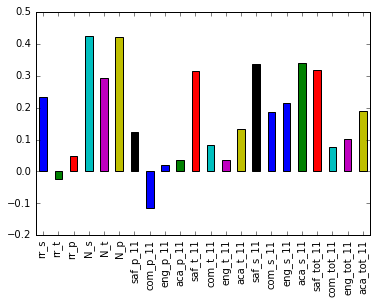
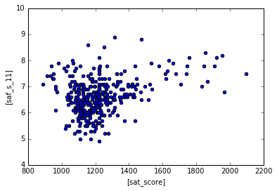
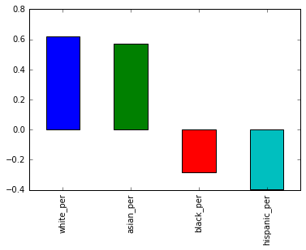
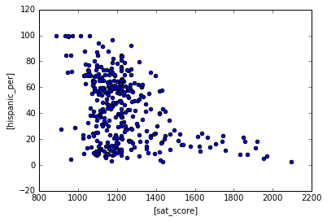
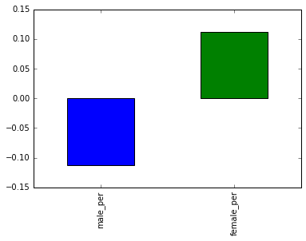
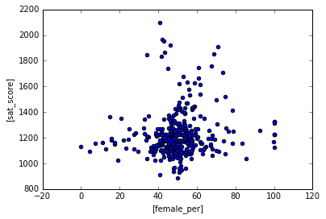
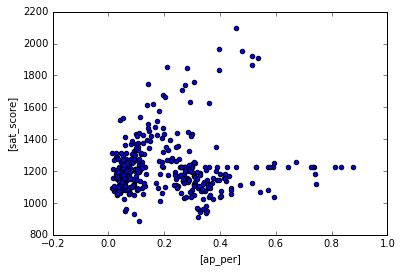

# Analyzing_NYC_HighSchool_data
One of the most controversial issues in the U.S. educational system is the efficacy of standardized tests, and whether they're unfair to certain groups. Given our prior knowledge of this topic, investigating the correlations between SAT scores and demographics might be an interesting angle to take. We could correlate SAT scores with factors like race, gender, income, and more.  

The SAT, or Scholastic Aptitude Test, is an exam that U.S. high school students take before applying to college. Colleges take the test scores into account when deciding who to admit, so it's fairly important to perform well on it.  The test consists of three sections, each of which has 800 possible points. The combined score is out of 2,400 possible points (while this number has changed a few times, the data set for our project is based on 2,400 total points). 

Organizations often rank high schools by their average SAT scores. The scores are also considered a measure of overall school district quality.  New York City makes its data on high school SAT scores available online, as well as the demographics for each high school.

Unfortunately, combining both of the data sets won't give us all of the demographic information we want to use. We'll need to supplement our data with other sources to do our full analysis.

The same website has several related data sets covering demographic information and test scores. Here are the links to all of the data sets we'll be using:

* SAT scores by school - SAT scores for each high school in New York City
* School attendance - Attendance information for each school in New York City
* Class size - Information on class size for each school
* AP test results - Advanced Placement (AP) exam results for each high school (passing an optional AP exam in a particular subject can earn a student college credit in that subject)
* Graduation outcomes - The percentage of students who graduated, and other outcome information
* Demographics - Demographic information for each school
* School survey - Surveys of parents, teachers, and students at each school


We'll need to combine them into a single data set before we can find correlations.

Before we move into coding, we'll need to do some background research. A thorough understanding of the data will help us avoid costly mistakes, such as thinking that a column represents something other than what it does. Background research will also give us a better understanding of how to combine and analyze the data.

In this case, we'll want to research:

New York City
The SAT
Schools in New York City
Our data
We can learn a few different things from these resources. For example:

Only high school students take the SAT, so we'll want to focus on high schools.
New York City is made up of five boroughs, which are essentially distinct regions.
New York City schools fall within several different school districts, each of which can contains dozens of schools.
Our data sets include several different types of schools. We'll need to clean them so that we can focus on high schools only.
Each school in New York City has a unique code called a DBN, or district borough number.
Aggregating data by district will allow us to use the district mapping data to plot district-by-district differences.


# Read in the data


```python
import pandas as pd
import numpy
import re

data_files = [
    "ap_2010.csv",
    "class_size.csv",
    "demographics.csv",
    "graduation.csv",
    "hs_directory.csv",
    "sat_results.csv"
]

data = {}

for f in data_files:
    d = pd.read_csv("schools/{0}".format(f))
    data[f.replace(".csv", "")] = d
```

# Read in the surveys


```python
all_survey = pd.read_csv("schools/survey_all.txt", delimiter="\t", encoding='windows-1252')
d75_survey = pd.read_csv("schools/survey_d75.txt", delimiter="\t", encoding='windows-1252')
survey = pd.concat([all_survey, d75_survey], axis=0)

survey["DBN"] = survey["dbn"]

survey_fields = [
    "DBN", 
    "rr_s", 
    "rr_t", 
    "rr_p", 
    "N_s", 
    "N_t", 
    "N_p", 
    "saf_p_11", 
    "com_p_11", 
    "eng_p_11", 
    "aca_p_11", 
    "saf_t_11", 
    "com_t_11", 
    "eng_t_11", 
    "aca_t_11", 
    "saf_s_11", 
    "com_s_11", 
    "eng_s_11", 
    "aca_s_11", 
    "saf_tot_11", 
    "com_tot_11", 
    "eng_tot_11", 
    "aca_tot_11",
]
survey = survey.loc[:,survey_fields]
data["survey"] = survey
```

# Add DBN columns


```python
data["hs_directory"]["DBN"] = data["hs_directory"]["dbn"]

def pad_csd(num):
    string_representation = str(num)
    if len(string_representation) > 1:
        return string_representation
    else:
        return "0" + string_representation
    
data["class_size"]["padded_csd"] = data["class_size"]["CSD"].apply(pad_csd)
data["class_size"]["DBN"] = data["class_size"]["padded_csd"] + data["class_size"]["SCHOOL CODE"]
```

# Convert columns to numeric


```python
cols = ['SAT Math Avg. Score', 'SAT Critical Reading Avg. Score', 'SAT Writing Avg. Score']
for c in cols:
    data["sat_results"][c] = pd.to_numeric(data["sat_results"][c], errors="coerce")

data['sat_results']['sat_score'] = data['sat_results'][cols[0]] + data['sat_results'][cols[1]] + data['sat_results'][cols[2]]

def find_lat(loc):
    coords = re.findall("\(.+, .+\)", loc)
    lat = coords[0].split(",")[0].replace("(", "")
    return lat

def find_lon(loc):
    coords = re.findall("\(.+, .+\)", loc)
    lon = coords[0].split(",")[1].replace(")", "").strip()
    return lon

data["hs_directory"]["lat"] = data["hs_directory"]["Location 1"].apply(find_lat)
data["hs_directory"]["lon"] = data["hs_directory"]["Location 1"].apply(find_lon)

data["hs_directory"]["lat"] = pd.to_numeric(data["hs_directory"]["lat"], errors="coerce")
data["hs_directory"]["lon"] = pd.to_numeric(data["hs_directory"]["lon"], errors="coerce")
```

# Condense datasets


```python
class_size = data["class_size"]
class_size = class_size[class_size["GRADE "] == "09-12"]
class_size = class_size[class_size["PROGRAM TYPE"] == "GEN ED"]

class_size = class_size.groupby("DBN").agg(numpy.mean)
class_size.reset_index(inplace=True)
data["class_size"] = class_size

data["demographics"] = data["demographics"][data["demographics"]["schoolyear"] == 20112012]

data["graduation"] = data["graduation"][data["graduation"]["Cohort"] == "2006"]
data["graduation"] = data["graduation"][data["graduation"]["Demographic"] == "Total Cohort"]
```

# Convert AP scores to numeric


```python
cols = ['AP Test Takers ', 'Total Exams Taken', 'Number of Exams with scores 3 4 or 5']

for col in cols:
    data["ap_2010"][col] = pd.to_numeric(data["ap_2010"][col], errors="coerce")
```

# Combine the datasets


```python
combined = data["sat_results"]

combined = combined.merge(data["ap_2010"], on="DBN", how="left")
combined = combined.merge(data["graduation"], on="DBN", how="left")

to_merge = ["class_size", "demographics", "survey", "hs_directory"]

for m in to_merge:
    combined = combined.merge(data[m], on="DBN", how="inner")

combined = combined.fillna(combined.mean())
combined = combined.fillna(0)
```

# Add a school district column for mapping


```python
def get_first_two_chars(dbn):
    return dbn[0:2]

combined["school_dist"] = combined["DBN"].apply(get_first_two_chars)
```

# Find correlations


```python
correlations = combined.corr()
correlations = correlations["sat_score"]
print(correlations)
```

    SAT Critical Reading Avg. Score         0.986820
    SAT Math Avg. Score                     0.972643
    SAT Writing Avg. Score                  0.987771
    sat_score                               1.000000
    AP Test Takers                          0.523140
    Total Exams Taken                       0.514333
    Number of Exams with scores 3 4 or 5    0.463245
    Total Cohort                            0.325144
    CSD                                     0.042948
    NUMBER OF STUDENTS / SEATS FILLED       0.394626
    NUMBER OF SECTIONS                      0.362673
    AVERAGE CLASS SIZE                      0.381014
    SIZE OF SMALLEST CLASS                  0.249949
    SIZE OF LARGEST CLASS                   0.314434
    SCHOOLWIDE PUPIL-TEACHER RATIO               NaN
    schoolyear                                   NaN
    fl_percent                                   NaN
    frl_percent                            -0.722225
    total_enrollment                        0.367857
    ell_num                                -0.153778
    ell_percent                            -0.398750
    sped_num                                0.034933
    sped_percent                           -0.448170
    asian_num                               0.475445
    asian_per                               0.570730
    black_num                               0.027979
    black_per                              -0.284139
    hispanic_num                            0.025744
    hispanic_per                           -0.396985
    white_num                               0.449559
                                              ...   
    rr_p                                    0.047925
    N_s                                     0.423463
    N_t                                     0.291463
    N_p                                     0.421530
    saf_p_11                                0.122913
    com_p_11                               -0.115073
    eng_p_11                                0.020254
    aca_p_11                                0.035155
    saf_t_11                                0.313810
    com_t_11                                0.082419
    eng_t_11                                0.036906
    aca_t_11                                0.132348
    saf_s_11                                0.337639
    com_s_11                                0.187370
    eng_s_11                                0.213822
    aca_s_11                                0.339435
    saf_tot_11                              0.318753
    com_tot_11                              0.077310
    eng_tot_11                              0.100102
    aca_tot_11                              0.190966
    grade_span_max                               NaN
    expgrade_span_max                            NaN
    zip                                    -0.063977
    total_students                          0.407827
    number_programs                         0.117012
    priority08                                   NaN
    priority09                                   NaN
    priority10                                   NaN
    lat                                    -0.121029
    lon                                    -0.132222
    Name: sat_score, Length: 67, dtype: float64


# Plotting survey correlations


```python
# Remove DBN since it's a unique identifier, not a useful numerical value for correlation.
survey_fields.remove("DBN")
```


```python
%matplotlib inline

correlations[survey_fields].plot.bar()

```


    <matplotlib.axes._subplots.AxesSubplot at 0x7f6e6f0397b8>





The saf_s_11 column measures how students perceive safety at the school, let's see how students do in the SATs if the schools have higher safety scores.


```python
combined.plot.scatter(['sat_score'], ["saf_s_11"])
```


    <matplotlib.axes._subplots.AxesSubplot at 0x7f6e6f020668>





Looks like there is a weak positive correlation between safety and SAT scores. Maybe it is easier for students to study when they are not worried about safety.

We can generate a NYC basemap and see which schools have lower safety scores, and color label the schools with lower safety scores with a different color


```python
import numpy

districts = combined.groupby("school_dist").agg(numpy.mean).round(2)

districts.reset_index(inplace=True)

districts.head(3)
```


<div>
<style scoped>
    .dataframe tbody tr th:only-of-type {
        vertical-align: middle;
    }

    .dataframe tbody tr th {
        vertical-align: top;
    }

    .dataframe thead th {
        text-align: right;
    }
</style>
<table border="1" class="dataframe">
  <thead>
    <tr style="text-align: right;">
      <th></th>
      <th>school_dist</th>
      <th>SAT Critical Reading Avg. Score</th>
      <th>SAT Math Avg. Score</th>
      <th>SAT Writing Avg. Score</th>
      <th>sat_score</th>
      <th>AP Test Takers</th>
      <th>Total Exams Taken</th>
      <th>Number of Exams with scores 3 4 or 5</th>
      <th>Total Cohort</th>
      <th>CSD</th>
      <th>...</th>
      <th>grade_span_max</th>
      <th>expgrade_span_max</th>
      <th>zip</th>
      <th>total_students</th>
      <th>number_programs</th>
      <th>priority08</th>
      <th>priority09</th>
      <th>priority10</th>
      <th>lat</th>
      <th>lon</th>
    </tr>
  </thead>
  <tbody>
    <tr>
      <th>0</th>
      <td>01</td>
      <td>441.83</td>
      <td>473.33</td>
      <td>439.33</td>
      <td>1354.50</td>
      <td>116.68</td>
      <td>173.02</td>
      <td>135.80</td>
      <td>93.50</td>
      <td>1.0</td>
      <td>...</td>
      <td>12.0</td>
      <td>12.0</td>
      <td>10003.17</td>
      <td>659.50</td>
      <td>1.33</td>
      <td>0.0</td>
      <td>0.0</td>
      <td>0.0</td>
      <td>40.72</td>
      <td>-73.98</td>
    </tr>
    <tr>
      <th>1</th>
      <td>02</td>
      <td>426.62</td>
      <td>444.19</td>
      <td>424.83</td>
      <td>1295.64</td>
      <td>128.91</td>
      <td>201.52</td>
      <td>157.50</td>
      <td>158.65</td>
      <td>2.0</td>
      <td>...</td>
      <td>12.0</td>
      <td>12.0</td>
      <td>10023.77</td>
      <td>621.40</td>
      <td>1.42</td>
      <td>0.0</td>
      <td>0.0</td>
      <td>0.0</td>
      <td>40.74</td>
      <td>-73.99</td>
    </tr>
    <tr>
      <th>2</th>
      <td>03</td>
      <td>428.53</td>
      <td>438.00</td>
      <td>426.92</td>
      <td>1293.44</td>
      <td>156.18</td>
      <td>244.52</td>
      <td>193.09</td>
      <td>183.38</td>
      <td>3.0</td>
      <td>...</td>
      <td>12.0</td>
      <td>12.0</td>
      <td>10023.75</td>
      <td>717.92</td>
      <td>2.00</td>
      <td>0.0</td>
      <td>0.0</td>
      <td>0.0</td>
      <td>40.78</td>
      <td>-73.98</td>
    </tr>
  </tbody>
</table>
<p>3 rows × 68 columns</p>
</div>


```python
from mpl_toolkits.basemap import Basemap

districts = combined.groupby("school_dist").agg(numpy.mean)
districts.reset_index(inplace=True)

m = Basemap(
    projection='merc', 
    llcrnrlat=40.496044, 
    urcrnrlat=40.915256, 
    llcrnrlon=-74.255735, 
    urcrnrlon=-73.700272,
    resolution='i'
)

m.drawmapboundary(fill_color='#85A6D9')
m.drawcoastlines(color='#6D5F47', linewidth=.4)
m.drawrivers(color='#6D5F47', linewidth=.4)

#converts to list
longitudes = districts['lon'].tolist()
latitudes = districts['lat'].tolist()
#generates a scatterplot with the 2 lists as arguments, s=20 for size of points, zorder=2 for dots on top of the map, latlong=True to indicate we are putting in the latitude/longitude
m.scatter(longitudes, latitudes, s=50, zorder=2, latlon=True, c=districts['saf_s_11'], cmap='summer')
plt.show()
```


Next we are interested to see if there is a correlation between race and SAT scores.


```python

races = [
    'white_per',
    'asian_per',
    'black_per',
    'hispanic_per',
]

correlations[races].plot.bar()
```


    <matplotlib.axes._subplots.AxesSubplot at 0x7f6e6d33eb70>





We are seeing positive correlation for whites/asians in SAT scores, negative correlations for blacks/hispanic in SAT scores. However, I wouldn't say any of these correlations are very strong. Let's use a scatter plot for hispanic to see if we can draw any insights.


```python
combined.plot.scatter(['sat_score'], ["hispanic_per"])
```


    <matplotlib.axes._subplots.AxesSubplot at 0x7f6e6d1900f0>





Schools with high amount of hispanics do poorly in the SATs. Schools with low amount of hispanics can do relatively well in the SATs. Let's filter the data down to scools with >95% Hispanics


```python
high_hispanic_schools = combined[combined['hispanic_per'] > 95]
high_hispanic_schools
```


<div>
<style scoped>
    .dataframe tbody tr th:only-of-type {
        vertical-align: middle;
    }

    .dataframe tbody tr th {
        vertical-align: top;
    }

    .dataframe thead th {
        text-align: right;
    }
</style>
<table border="1" class="dataframe">
  <thead>
    <tr style="text-align: right;">
      <th></th>
      <th>DBN</th>
      <th>SCHOOL NAME</th>
      <th>Num of SAT Test Takers</th>
      <th>SAT Critical Reading Avg. Score</th>
      <th>SAT Math Avg. Score</th>
      <th>SAT Writing Avg. Score</th>
      <th>sat_score</th>
      <th>SchoolName</th>
      <th>AP Test Takers</th>
      <th>Total Exams Taken</th>
      <th>...</th>
      <th>priority05</th>
      <th>priority06</th>
      <th>priority07</th>
      <th>priority08</th>
      <th>priority09</th>
      <th>priority10</th>
      <th>Location 1</th>
      <th>lat</th>
      <th>lon</th>
      <th>school_dist</th>
    </tr>
  </thead>
  <tbody>
    <tr>
      <th>44</th>
      <td>02M542</td>
      <td>MANHATTAN BRIDGES HIGH SCHOOL</td>
      <td>66</td>
      <td>336.0</td>
      <td>378.0</td>
      <td>344.0</td>
      <td>1058.0</td>
      <td>Manhattan Bridges High School</td>
      <td>67.000000</td>
      <td>102.000000</td>
      <td>...</td>
      <td>0</td>
      <td>0</td>
      <td>0</td>
      <td>0</td>
      <td>0</td>
      <td>0</td>
      <td>525 West 50Th Street\nNew York, NY 10019\n(40....</td>
      <td>40.765027</td>
      <td>-73.992517</td>
      <td>02</td>
    </tr>
    <tr>
      <th>82</th>
      <td>06M348</td>
      <td>WASHINGTON HEIGHTS EXPEDITIONARY LEARNING SCHOOL</td>
      <td>70</td>
      <td>380.0</td>
      <td>395.0</td>
      <td>399.0</td>
      <td>1174.0</td>
      <td>0</td>
      <td>129.028846</td>
      <td>197.038462</td>
      <td>...</td>
      <td>Then to New York City residents</td>
      <td>0</td>
      <td>0</td>
      <td>0</td>
      <td>0</td>
      <td>0</td>
      <td>511 West 182Nd Street\nNew York, NY 10033\n(40...</td>
      <td>40.848879</td>
      <td>-73.930807</td>
      <td>06</td>
    </tr>
    <tr>
      <th>89</th>
      <td>06M552</td>
      <td>GREGORIO LUPERON HIGH SCHOOL FOR SCIENCE AND M...</td>
      <td>56</td>
      <td>339.0</td>
      <td>349.0</td>
      <td>326.0</td>
      <td>1014.0</td>
      <td>GREGORIO LUPERON HS SCI &amp; MATH</td>
      <td>88.000000</td>
      <td>138.000000</td>
      <td>...</td>
      <td>0</td>
      <td>0</td>
      <td>0</td>
      <td>0</td>
      <td>0</td>
      <td>0</td>
      <td>501 West 165Th\nNew York, NY 10032\n(40.838032...</td>
      <td>40.838032</td>
      <td>-73.938371</td>
      <td>06</td>
    </tr>
    <tr>
      <th>125</th>
      <td>09X365</td>
      <td>ACADEMY FOR LANGUAGE AND TECHNOLOGY</td>
      <td>54</td>
      <td>315.0</td>
      <td>339.0</td>
      <td>297.0</td>
      <td>951.0</td>
      <td>Academy for Language and Technology</td>
      <td>20.000000</td>
      <td>20.000000</td>
      <td>...</td>
      <td>0</td>
      <td>0</td>
      <td>0</td>
      <td>0</td>
      <td>0</td>
      <td>0</td>
      <td>1700 Macombs Road\nBronx, NY 10453\n(40.849102...</td>
      <td>40.849102</td>
      <td>-73.916088</td>
      <td>09</td>
    </tr>
    <tr>
      <th>141</th>
      <td>10X342</td>
      <td>INTERNATIONAL SCHOOL FOR LIBERAL ARTS</td>
      <td>49</td>
      <td>300.0</td>
      <td>333.0</td>
      <td>301.0</td>
      <td>934.0</td>
      <td>International School for Liberal Arts</td>
      <td>55.000000</td>
      <td>73.000000</td>
      <td>...</td>
      <td>0</td>
      <td>0</td>
      <td>0</td>
      <td>0</td>
      <td>0</td>
      <td>0</td>
      <td>2780 Reservoir Avenue\nBronx, NY 10468\n(40.87...</td>
      <td>40.870377</td>
      <td>-73.898163</td>
      <td>10</td>
    </tr>
    <tr>
      <th>176</th>
      <td>12X388</td>
      <td>PAN AMERICAN INTERNATIONAL HIGH SCHOOL AT MONROE</td>
      <td>30</td>
      <td>321.0</td>
      <td>351.0</td>
      <td>298.0</td>
      <td>970.0</td>
      <td>0</td>
      <td>129.028846</td>
      <td>197.038462</td>
      <td>...</td>
      <td>0</td>
      <td>0</td>
      <td>0</td>
      <td>0</td>
      <td>0</td>
      <td>0</td>
      <td>1300 Boynton Avenue\nBronx, NY 10472\n(40.8313...</td>
      <td>40.831366</td>
      <td>-73.878823</td>
      <td>12</td>
    </tr>
    <tr>
      <th>253</th>
      <td>19K583</td>
      <td>MULTICULTURAL HIGH SCHOOL</td>
      <td>29</td>
      <td>279.0</td>
      <td>322.0</td>
      <td>286.0</td>
      <td>887.0</td>
      <td>Multicultural High School</td>
      <td>44.000000</td>
      <td>44.000000</td>
      <td>...</td>
      <td>0</td>
      <td>0</td>
      <td>0</td>
      <td>0</td>
      <td>0</td>
      <td>0</td>
      <td>999 Jamaica Avenue\nBrooklyn, NY 11208\n(40.69...</td>
      <td>40.691144</td>
      <td>-73.868426</td>
      <td>19</td>
    </tr>
    <tr>
      <th>286</th>
      <td>24Q296</td>
      <td>PAN AMERICAN INTERNATIONAL HIGH SCHOOL</td>
      <td>55</td>
      <td>317.0</td>
      <td>323.0</td>
      <td>311.0</td>
      <td>951.0</td>
      <td>0</td>
      <td>129.028846</td>
      <td>197.038462</td>
      <td>...</td>
      <td>0</td>
      <td>0</td>
      <td>0</td>
      <td>0</td>
      <td>0</td>
      <td>0</td>
      <td>45-10 94Th Street\nElmhurst, NY 11373\n(40.743...</td>
      <td>40.743303</td>
      <td>-73.870575</td>
      <td>24</td>
    </tr>
  </tbody>
</table>
<p>8 rows × 160 columns</p>
</div>


Using google searches, we found out that these schools have students who recently immigrated, so most of them are probably still ESL students. It makes sense they do not perform as well in SATs.

Next we'll look correlations between gender and SAT scores

Let's filter the data to see the schools with low hispanics AND high SAT scores.


```python
low_hispanic_high_sat = combined[(combined['hispanic_per'] < 10) & (combined['sat_score'] > 1800)]
low_hispanic_high_sat
```


<div>
<style scoped>
    .dataframe tbody tr th:only-of-type {
        vertical-align: middle;
    }

    .dataframe tbody tr th {
        vertical-align: top;
    }

    .dataframe thead th {
        text-align: right;
    }
</style>
<table border="1" class="dataframe">
  <thead>
    <tr style="text-align: right;">
      <th></th>
      <th>DBN</th>
      <th>SCHOOL NAME</th>
      <th>Num of SAT Test Takers</th>
      <th>SAT Critical Reading Avg. Score</th>
      <th>SAT Math Avg. Score</th>
      <th>SAT Writing Avg. Score</th>
      <th>sat_score</th>
      <th>SchoolName</th>
      <th>AP Test Takers</th>
      <th>Total Exams Taken</th>
      <th>...</th>
      <th>priority05</th>
      <th>priority06</th>
      <th>priority07</th>
      <th>priority08</th>
      <th>priority09</th>
      <th>priority10</th>
      <th>Location 1</th>
      <th>lat</th>
      <th>lon</th>
      <th>school_dist</th>
    </tr>
  </thead>
  <tbody>
    <tr>
      <th>37</th>
      <td>02M475</td>
      <td>STUYVESANT HIGH SCHOOL</td>
      <td>832</td>
      <td>679.0</td>
      <td>735.0</td>
      <td>682.0</td>
      <td>2096.0</td>
      <td>STUYVESANT HS</td>
      <td>1510.0</td>
      <td>2819.0</td>
      <td>...</td>
      <td>0</td>
      <td>0</td>
      <td>0</td>
      <td>0</td>
      <td>0</td>
      <td>0</td>
      <td>345 Chambers Street\nNew York, NY 10282\n(40.7...</td>
      <td>40.717746</td>
      <td>-74.014049</td>
      <td>02</td>
    </tr>
    <tr>
      <th>151</th>
      <td>10X445</td>
      <td>BRONX HIGH SCHOOL OF SCIENCE</td>
      <td>731</td>
      <td>632.0</td>
      <td>688.0</td>
      <td>649.0</td>
      <td>1969.0</td>
      <td>BRONX HS OF SCIENCE</td>
      <td>1190.0</td>
      <td>2435.0</td>
      <td>...</td>
      <td>0</td>
      <td>0</td>
      <td>0</td>
      <td>0</td>
      <td>0</td>
      <td>0</td>
      <td>75 West 205 Street\nBronx, NY 10468\n(40.87705...</td>
      <td>40.877056</td>
      <td>-73.889780</td>
      <td>10</td>
    </tr>
    <tr>
      <th>187</th>
      <td>13K430</td>
      <td>BROOKLYN TECHNICAL HIGH SCHOOL</td>
      <td>1277</td>
      <td>587.0</td>
      <td>659.0</td>
      <td>587.0</td>
      <td>1833.0</td>
      <td>BROOKLYN TECHNICAL HS</td>
      <td>2117.0</td>
      <td>3692.0</td>
      <td>...</td>
      <td>0</td>
      <td>0</td>
      <td>0</td>
      <td>0</td>
      <td>0</td>
      <td>0</td>
      <td>29 Ft Greene Place\nBrooklyn, NY 11217\n(40.68...</td>
      <td>40.688107</td>
      <td>-73.976745</td>
      <td>13</td>
    </tr>
    <tr>
      <th>327</th>
      <td>28Q687</td>
      <td>QUEENS HIGH SCHOOL FOR THE SCIENCES AT YORK CO...</td>
      <td>121</td>
      <td>612.0</td>
      <td>660.0</td>
      <td>596.0</td>
      <td>1868.0</td>
      <td>Queens HS for Science York Colllege</td>
      <td>215.0</td>
      <td>338.0</td>
      <td>...</td>
      <td>0</td>
      <td>0</td>
      <td>0</td>
      <td>0</td>
      <td>0</td>
      <td>0</td>
      <td>94-50 159 Street\nJamaica, NY 11433\n(40.70099...</td>
      <td>40.700999</td>
      <td>-73.798154</td>
      <td>28</td>
    </tr>
    <tr>
      <th>356</th>
      <td>31R605</td>
      <td>STATEN ISLAND TECHNICAL HIGH SCHOOL</td>
      <td>227</td>
      <td>635.0</td>
      <td>682.0</td>
      <td>636.0</td>
      <td>1953.0</td>
      <td>STATEN ISLAND TECHNICAL HS</td>
      <td>528.0</td>
      <td>905.0</td>
      <td>...</td>
      <td>0</td>
      <td>0</td>
      <td>0</td>
      <td>0</td>
      <td>0</td>
      <td>0</td>
      <td>485 Clawson Street\nStaten Island, NY 10306\n(...</td>
      <td>40.567913</td>
      <td>-74.115362</td>
      <td>31</td>
    </tr>
  </tbody>
</table>
<p>5 rows × 160 columns</p>
</div>


These are some of the tope high schools in the nation


```python
genders =['male_per', 'female_per']

correlations[genders].plot.bar()
```


    <matplotlib.axes._subplots.AxesSubplot at 0x7f6e6d24e748>





Seems like theres very little correlation overall for both sides small positive correlation for females and small negative correlation for males.


```python
combined.plot.scatter(["female_per"], ["sat_score"])
```


    <matplotlib.axes._subplots.AxesSubplot at 0x7f6e6f4f1ac8>





Scatter plot doesn't show much, data seems very scattered and we are not seeing much correlation between schools with more females and SAT scores.

Let's look at schools with < 60% females and higher than 1700 SAT scores


```python
high_females_sat_scores = combined[(combined["female_per"] > 60) & (combined["sat_score"] > 1700)]
high_females_sat_scores
```


<div>
<style scoped>
    .dataframe tbody tr th:only-of-type {
        vertical-align: middle;
    }

    .dataframe tbody tr th {
        vertical-align: top;
    }

    .dataframe thead th {
        text-align: right;
    }
</style>
<table border="1" class="dataframe">
  <thead>
    <tr style="text-align: right;">
      <th></th>
      <th>DBN</th>
      <th>SCHOOL NAME</th>
      <th>Num of SAT Test Takers</th>
      <th>SAT Critical Reading Avg. Score</th>
      <th>SAT Math Avg. Score</th>
      <th>SAT Writing Avg. Score</th>
      <th>sat_score</th>
      <th>SchoolName</th>
      <th>AP Test Takers</th>
      <th>Total Exams Taken</th>
      <th>...</th>
      <th>priority05</th>
      <th>priority06</th>
      <th>priority07</th>
      <th>priority08</th>
      <th>priority09</th>
      <th>priority10</th>
      <th>Location 1</th>
      <th>lat</th>
      <th>lon</th>
      <th>school_dist</th>
    </tr>
  </thead>
  <tbody>
    <tr>
      <th>5</th>
      <td>01M696</td>
      <td>BARD HIGH SCHOOL EARLY COLLEGE</td>
      <td>130</td>
      <td>624.0</td>
      <td>604.0</td>
      <td>628.0</td>
      <td>1856.0</td>
      <td>0</td>
      <td>129.028846</td>
      <td>197.038462</td>
      <td>...</td>
      <td>0</td>
      <td>0</td>
      <td>0</td>
      <td>0</td>
      <td>0</td>
      <td>0</td>
      <td>525 East Houston Street\nNew York, NY 10002\n(...</td>
      <td>40.718962</td>
      <td>-73.976066</td>
      <td>01</td>
    </tr>
    <tr>
      <th>26</th>
      <td>02M416</td>
      <td>ELEANOR ROOSEVELT HIGH SCHOOL</td>
      <td>127</td>
      <td>572.0</td>
      <td>594.0</td>
      <td>592.0</td>
      <td>1758.0</td>
      <td>Eleanor Roosevelt High School</td>
      <td>155.000000</td>
      <td>235.000000</td>
      <td>...</td>
      <td>0</td>
      <td>0</td>
      <td>0</td>
      <td>0</td>
      <td>0</td>
      <td>0</td>
      <td>411 East 76 Street\nNew York, NY 10021\n(40.77...</td>
      <td>40.770116</td>
      <td>-73.953379</td>
      <td>02</td>
    </tr>
    <tr>
      <th>60</th>
      <td>03M479</td>
      <td>BEACON HIGH SCHOOL</td>
      <td>261</td>
      <td>577.0</td>
      <td>575.0</td>
      <td>592.0</td>
      <td>1744.0</td>
      <td>BEACON SCHOOL</td>
      <td>166.000000</td>
      <td>197.000000</td>
      <td>...</td>
      <td>0</td>
      <td>0</td>
      <td>0</td>
      <td>0</td>
      <td>0</td>
      <td>0</td>
      <td>227-243 West 61St Street\nNew York, NY 10023\n...</td>
      <td>40.772158</td>
      <td>-73.987797</td>
      <td>03</td>
    </tr>
    <tr>
      <th>61</th>
      <td>03M485</td>
      <td>FIORELLO H. LAGUARDIA HIGH SCHOOL OF MUSIC &amp; A...</td>
      <td>531</td>
      <td>566.0</td>
      <td>564.0</td>
      <td>577.0</td>
      <td>1707.0</td>
      <td>FIORELLO H.LAGUARDIA HS</td>
      <td>691.000000</td>
      <td>1236.000000</td>
      <td>...</td>
      <td>0</td>
      <td>0</td>
      <td>0</td>
      <td>0</td>
      <td>0</td>
      <td>0</td>
      <td>100 Amsterdam Avenue\nNew York, NY 10023\n(40....</td>
      <td>40.773671</td>
      <td>-73.985269</td>
      <td>03</td>
    </tr>
    <tr>
      <th>302</th>
      <td>25Q525</td>
      <td>TOWNSEND HARRIS HIGH SCHOOL</td>
      <td>278</td>
      <td>621.0</td>
      <td>651.0</td>
      <td>638.0</td>
      <td>1910.0</td>
      <td>TOWNSEND HARRIS HS</td>
      <td>613.000000</td>
      <td>796.000000</td>
      <td>...</td>
      <td>0</td>
      <td>0</td>
      <td>0</td>
      <td>0</td>
      <td>0</td>
      <td>0</td>
      <td>149-11 Melbourne Avenue\nFlushing, NY 11367\n(...</td>
      <td>40.734408</td>
      <td>-73.821417</td>
      <td>25</td>
    </tr>
  </tbody>
</table>
<p>5 rows × 160 columns</p>
</div>


A google search shows that these schools are heavily STEM focused and have higher entrance requirements, so it makes sense that they have higher SAT scores

Let's take a look at AP test takers in these schools. It is possible that AP test takers score higher in SATS.


```python
combined['ap_per'] = combined['AP Test Takers ']/combined['total_enrollment']

combined.plot.scatter(['ap_per'],['sat_score'])
```


    <matplotlib.axes._subplots.AxesSubplot at 0x7f6e6d14a860>





Schools with low AP test takers tend to score low on SAT as well. Wheras schools with high AP test takers generally score higher. This makes sense because students who enroll in AP classes are generally honor students so they study hard for the SATs as well.


Learning Summary¶
Python concepts explored: pandas, matplotlib.pyplot, correlations, regex, basemap, data analysis, string manipulation

Python functions and methods used: .scatter(), info(), .tolist(), .groupby(), .agg(), .concat(), .apply(), .strip, .merge(), .fillna(), .corr()


```python

```

